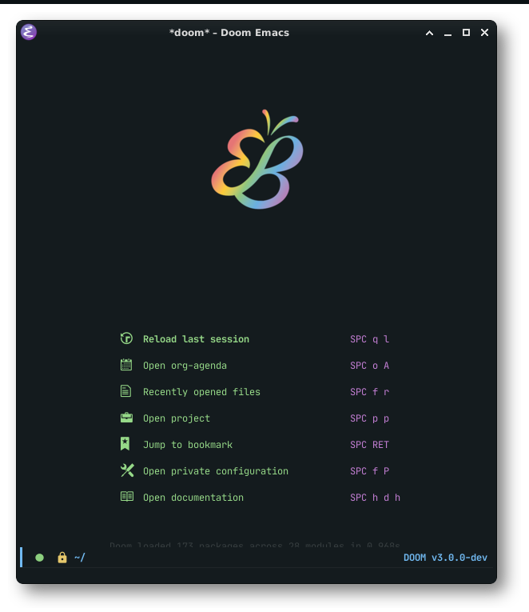
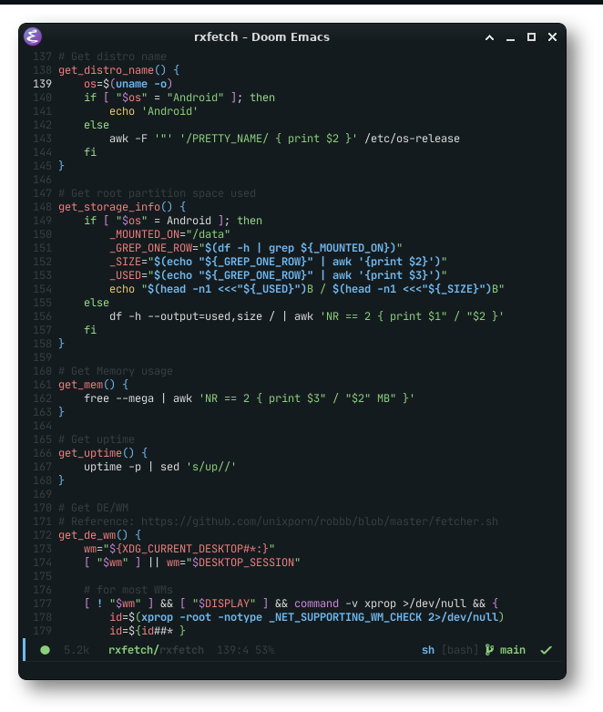

<h2 align="center"> Everblush DoomEmacs </h2> 

## Preview



## Installation

make sure you have themes folder inside your ~/.doom.d, then run this command

```
wget https://raw.githubusercontent.com/Everblush/doomemacs/main/everblush-theme.el -O ~/.doom.d/themes/everblush-theme.el
```
then you can enable the theme in your config.el (you should know how to do it right?)

## Credits

- [SamuelNihBos](https://github.com/samuelnihbos)
